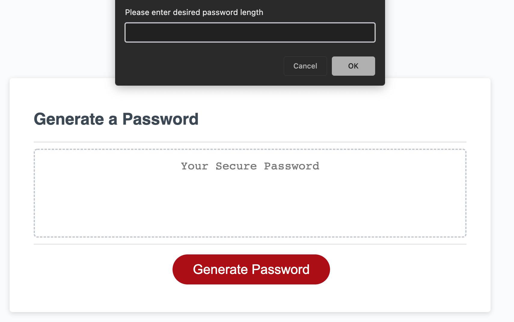
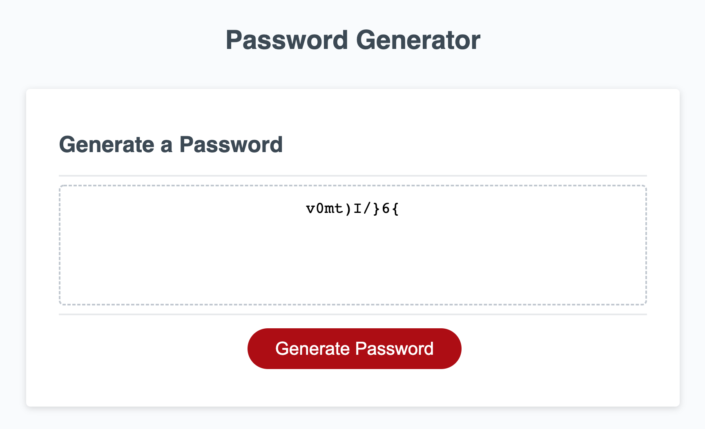
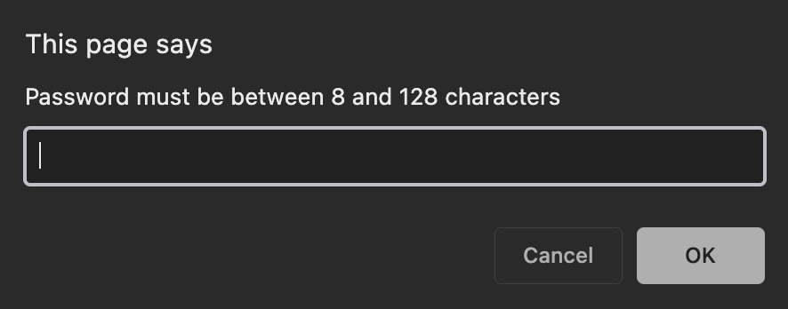
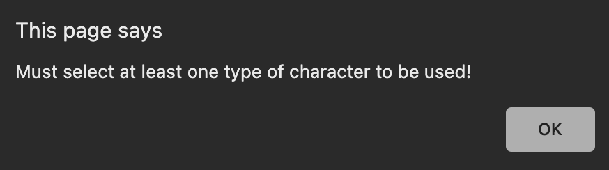

# password-generator

## Client Ask
GIVEN I need a new, secure password

WHEN I click the button to generate a password

THEN I am presented with a series of prompts for password criteria

WHEN prompted for password criteria

THEN I select which criteria to include in the password

WHEN prompted for the length of the password

THEN I choose a length of at least 8 characters and no more than 128 characters

WHEN asked for character types to include in the password

THEN I confirm whether or not to include lowercase, uppercase, numeric, and/or special characters

WHEN I answer each prompt

THEN my input should be validated and at least one character type should be selected

WHEN all prompts are answered

THEN a password is generated that matches the selected criteria

WHEN the password is generated

THEN the password is either displayed in an alert or written to the page

## What was provided
Starter HTML

Starter CSS

Java sheet with build for a button and related function

## What was done
Added functionality to the button so that the user is first prompted with how long they want the password to be

The length of the password must be between 8 and 128 characters and any number outside that range is rejected

Then 4 prompts follow that confirm whether or not the user wants uppercase letters, lowercase letters, special characters or numbers

For each parameter that is confirmed, that applicable range of characters is added to the possible list of characters to pull from. If all of the parameters are rejected then an alert lets the user know they must pick at least one

A for loop then generates a random character from the pool for the duration of the passwordLength and concatenates the characters into a final string

This string is then displayed in the box as required

## Screenshot of prompt

## Screenshot of final result

## Screenshots of errors being alerted to user

## Deployed application URL
https://randronaco1027.github.io/password-generator/ 